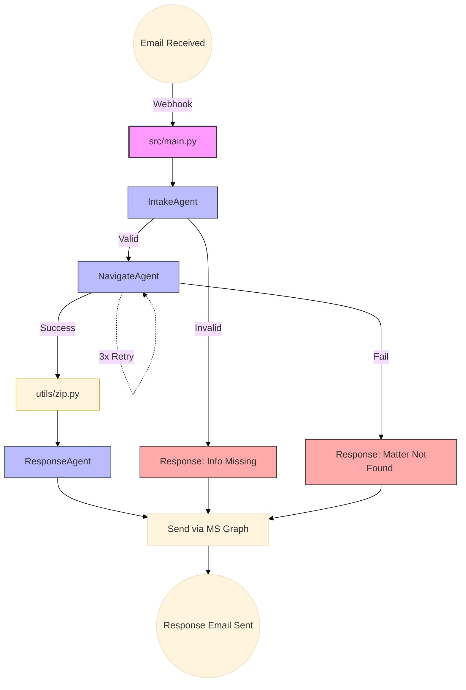

# Agent Mailbox for Document Querying

Multi-agent automation pipeline for UARB matter lookup and document download.

The app receives incoming email requests through AgentMail, runs a 3-agent workflow, zips downloaded files from [UARB](https://uarb.novascotia.ca/fmi/webd/UARB15), and sends the final response email through your personal Outlook account.

## What It Does

1. Receives an inbound request email (AgentMail webhook).
2. `IntakeAgent` parses the email for:
	 - Matter number (`M#####`)
	 - Document type (`Exhibits`, `Key Documents`, `Other Documents`, `Transcripts`, `Recordings`)
3. `NavigateAgent` opens the UARB site, finds the matter, counts documents, and downloads files.
4. `utils.zip.zip()` compresses downloaded PDFs into `downloads/<matter_number>.zip`.
5. `ResponseAgent` generates a polished response body.
6. `main.py` sends the response email via Microsoft Graph API (with upload session for large attachments).

## DAG


## Project Structure

```text
src/
	main.py                  # Webhook server, orchestration, Email Logic
	agents/
		intake_agent.py        # Extracts matter number + doc type from inbound email
		navigate_agent.py      # Browser automation on UARB site + download logic
		response_agent.py      # Builds final outbound response text
	utils/
		zip.py                 # Compresses matter downloads to downloads/<matter>.zip

downloads/                 # Downloaded PDFs + generated ZIP files
```

## Requirements

- Python 3.10+
- Access to:
	- Google Gemini API
	- AgentMail API
	- Microsoft Graph API (mail send permissions)
	- ngrok auth token

## Install

From project root:

```bash
python3 -m venv venv
source venv/bin/activate
pip install -r requirements.txt
```

## Environment Variables

Create/update `.env` with:

```env
GEMINI_API_KEY=your_gemini_api_key
AGENTMAIL_KEY=your_agentmail_api_key
INBOX_ID=your_inbox_id@agentmail.to
INBOX_USERNAME=your_inbox_username
NGROK_AUTHTOKEN=your_ngrok_authtoken
MICROSOFT_API=your_microsoft_graph_bearer_token 

# Optional
WEBHOOK_DOMAIN=your-custom-ngrok-domain
```

Notes:
- `MICROSOFT_API` should be a valid Graph bearer token.
- For sending mail with attachments, your token/app must include Graph mail permissions (for example `Mail.Send`, and draft/attachment permissions as needed).

## Run The Full App

```bash
python3 src/main.py
```

Expected behavior:

- Starts ngrok tunnel.
- Creates or reuses AgentMail webhook for `message.received`.
- Waits for inbound email on `INBOX_ID`.
- Processes each message in a background thread.

## Run Individual Agents

### Intake Agent

```bash
python3 src/agents/intake_agent.py
```

### Navigate Agent

```bash
python3 src/agents/navigate_agent.py
```

### Response Agent

```bash
python3 src/agents/response_agent.py
```

## Test ZIP Creation

```bash
python3 -c "from src.utils.zip import zip; zip('M12205')"
```

This produces:

```text
downloads/M12205.zip
```

## Current Email Flow

- Receive: AgentMail webhook (`src/main.py`)
- Send: Microsoft Graph API (`send_email()` in `src/main.py`)

This split avoids AgentMail attachment size constraints when replying with ZIP files.
